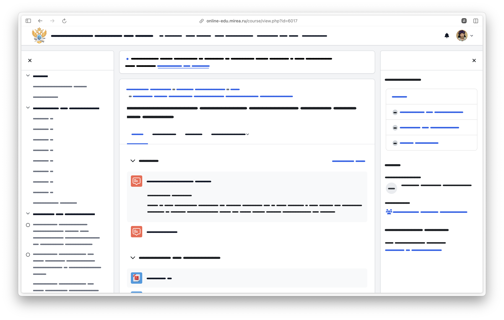
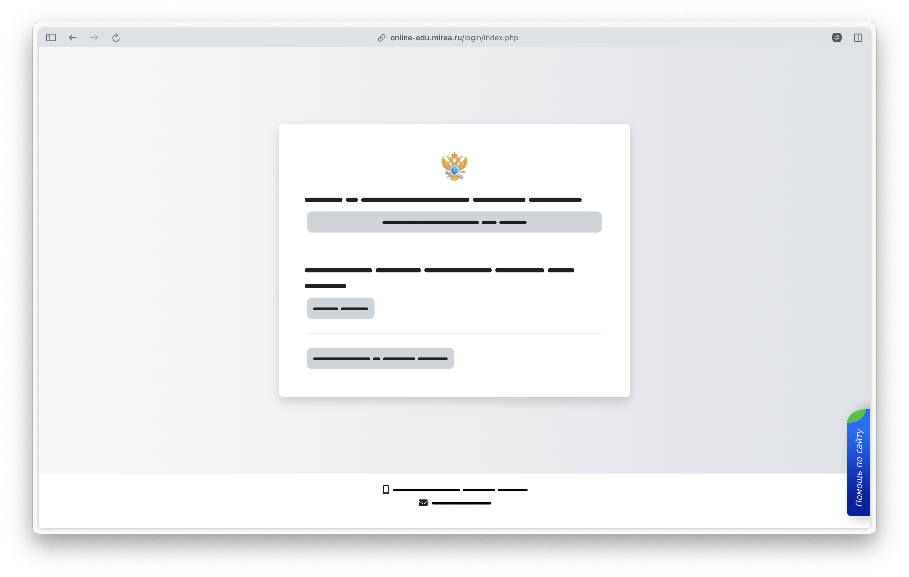
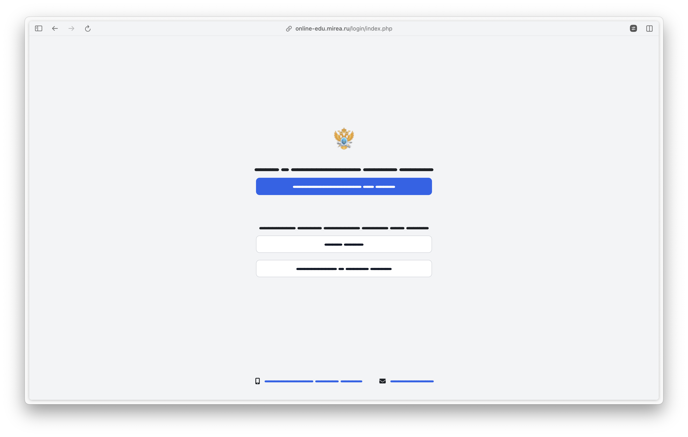
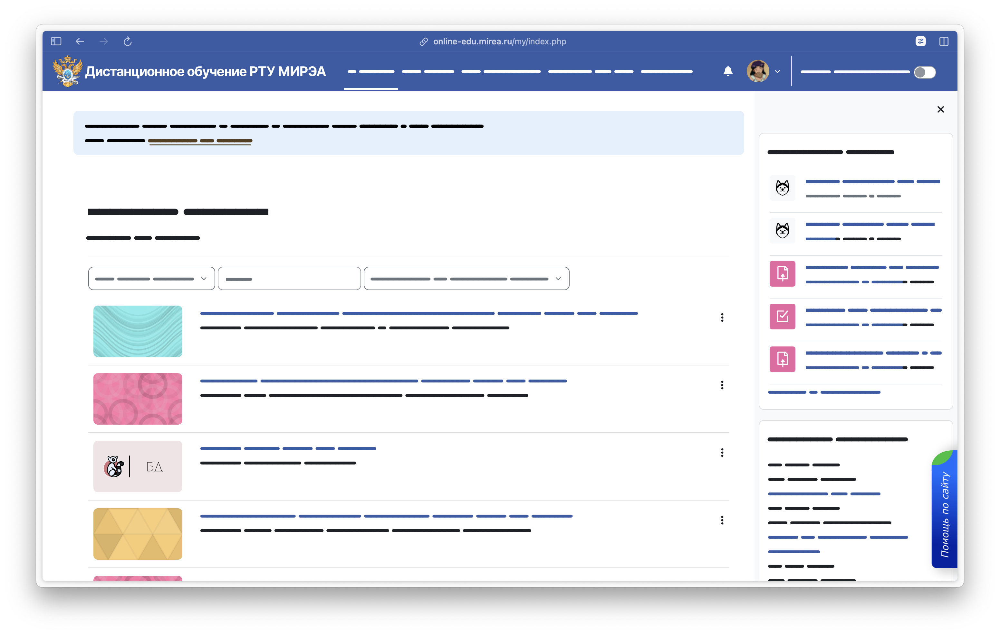
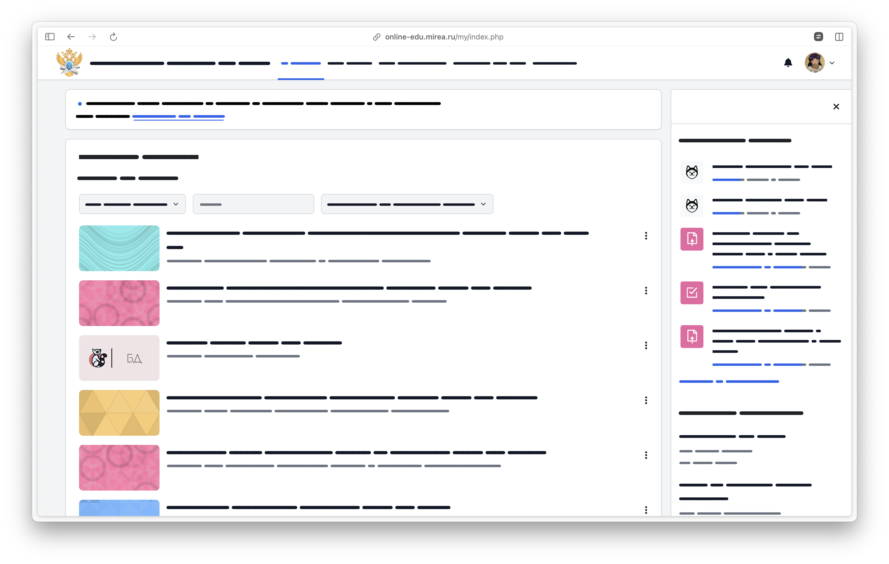
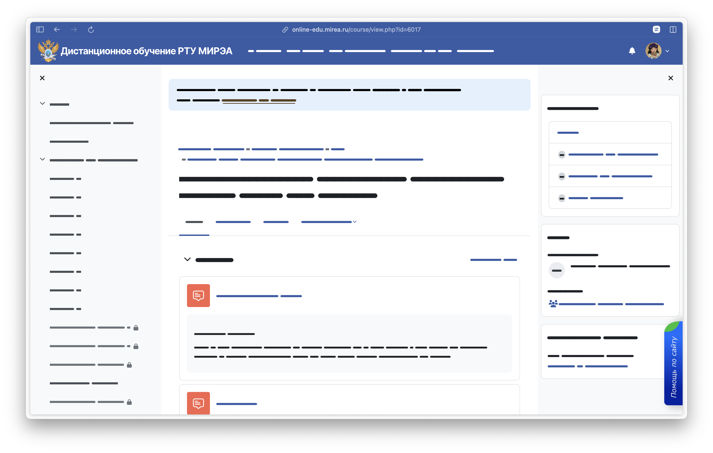

# Better SDO — каким должен был быть редизайн СДО

> _Автор расширения не отвечает за правильную работоспособность сайта. Дизайн предоставлен "AS IS"_

**Для _рефреша редизайна_ `online-edu.mirea.ru` я взял за основу обновленную страницу входа `login.mirea.ru`: цвета, общую стилистику.** Сделано ведь очень круто! Почему нельзя было сразу так сделать?

<p align="middle">
    
</p>

### _Made by [DANYATOUGEDREAMS](https://danyatougedreams.ru)_

---

### До / После

<p align="middle">
    
    
</p>

<p align="middle">
    
    
</p>

<p align="middle">
    
    
</p>

## Хочу! Как установить?

### Вариант 1: Через Stylus

Заходи [по ссылке](https://userstyles.world/style/18429/better-sdo) и нажимай кнопку `Install`

### Вариант 2: Самому напрямую в расширения браузера

1. Скачай и распакуй [архив с расширением](https://github.com/danyatougedreams/bettersdo/releases/tag/v1.0)
2. Заходи в раздел расширений своего браузера
3. Включи режим разработчика
4. Нажми на кнопку "Загрузить распакованное"
5. Выбери папку, куда распаковал архив (или файл manifest.json в нем)
6. Готово!

## Как собрать CSS файл

### 1. Установи [SASS](https://sasscss.org/install)

```bash
# Windows с установленным choco
choco install sass
```

```bash
# MacOS
brew install sass/sass/sass
```

### 2. Собери

```bash
git clone https://github.com/danyatougedreams/bettersdo

cd bettersdo

sass --style compressed --no-source-map source/styles/main.scss:source/bettersdo.css
```
